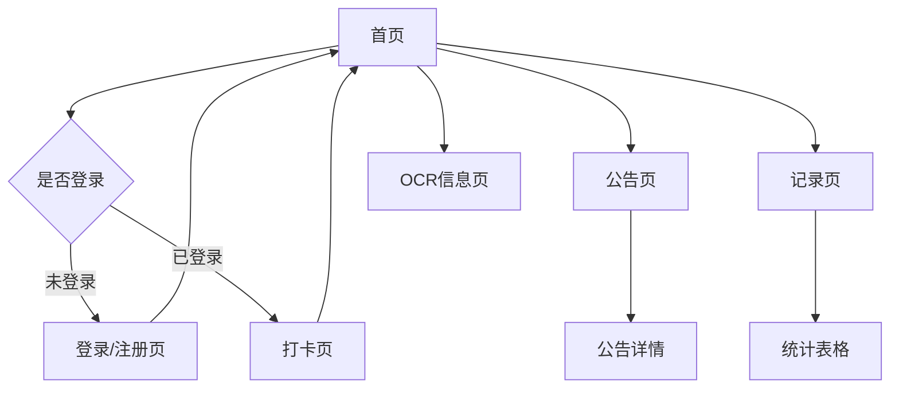

## 1. 产品概述
一个基于GitHub Pages的打卡网站，支持用户注册登录、富文本打卡、公告发布、记录统计和OCR信息保存功能。

解决用户日常打卡记录需求，提供便捷的打卡体验和数据统计，适合个人或小团队使用。

## 2. 核心功能

### 2.1 用户角色
| 角色 | 注册方式 | 核心权限 |
|------|----------|----------|
| 普通用户 | 邮箱注册 | 打卡、查看公告、查看记录 |
| 管理员 | 后台设置 | 发布公告、查看所有统计 |

### 2.2 功能模块
打卡网站包含以下主要页面：
1. **首页**：顶部导航栏、公告展示、打卡信息流
2. **登录/注册页**：用户身份验证
3. **打卡页**：富文本编辑器、图片上传
4. **公告页**：公告列表、详情查看
5. **记录页**：个人打卡历史、统计表格
6. **OCR信息页**：图片上传、文字识别、信息保存

### 2.3 页面详情
| 页面名称 | 模块名称 | 功能描述 |
|----------|----------|----------|
| 首页 | 顶部导航栏 | 包含打卡、公告、记录、登录/登出按钮 |
| 首页 | 公告展示区 | 显示最新3条公告标题和预览内容 |
| 首页 | 打卡信息流 | 显示用户打卡记录，按时间倒序排列 |
| 登录页 | 登录表单 | 输入邮箱和密码进行登录 |
| 注册页 | 注册表单 | 输入邮箱、密码、确认密码进行注册 |
| 打卡页 | 富文本编辑器 | 支持文字编辑、图片上传、截图粘贴 |
| 打卡页 | 提交按钮 | 保存打卡内容并返回首页 |
| 公告页 | 公告列表 | 显示所有公告标题、发布时间 |
| 公告页 | 公告详情 | 显示完整公告内容，支持富文本和链接 |
| 记录页 | 个人记录 | 显示当前用户的打卡历史 |
| 记录页 | 统计表格 | 表格形式展示所有用户打卡记录 |
| OCR信息页 | 图片上传 | 支持拖拽或选择图片文件 |
| OCR信息页 | 文字识别 | 自动识别图片中的文字内容 |
| OCR信息页 | 信息保存 | 将识别结果保存到用户数据 |

## 3. 核心流程
用户首次访问网站时，可以看到首页的公告和打卡信息。如需打卡，需先注册登录。登录后可以发布打卡内容，查看个人记录。管理员可以发布公告，所有用户都可以查看公告详情。

## 4. 用户界面设计

### 4.1 设计风格
- 主色调：蓝色系（#3B82F6）
- 辅助色：灰色系（#6B7280）
- 按钮样式：圆角矩形，hover效果
- 字体：系统默认字体，标题18px，正文14px
- 布局风格：卡片式布局，顶部固定导航
- 图标：使用简洁的线性图标

### 4.2 页面设计概览
| 页面名称 | 模块名称 | UI元素 |
|----------|----------|--------|
| 首页 | 导航栏 | 白色背景，蓝色按钮，固定在顶部 |
| 首页 | 公告区 | 白色卡片，阴影效果，标题加粗 |
| 首页 | 打卡流 | 卡片式布局，显示用户头像、名称、时间 |
| 打卡页 | 编辑器 | 白色背景，工具栏在顶部，编辑区域有边框 |
| 记录页 | 统计表 | 表格样式，斑马线效果，可排序 |

### 4.3 响应式设计
采用桌面端优先设计，适配移动端显示。导航栏在小屏幕下变为汉堡菜单，卡片布局自动调整宽度。