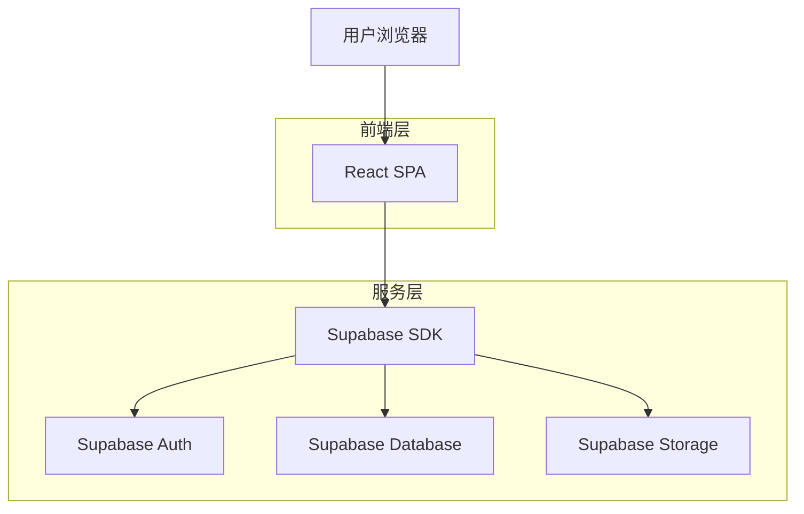
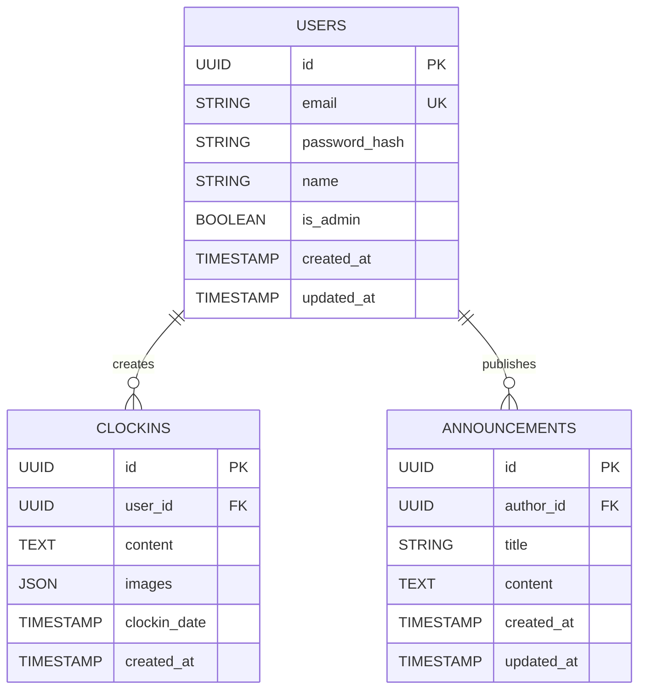

## 1. 架构设计



## 2. 技术描述

- 前端：React@18 + Tailwind CSS@3 + Vite
- 初始化工具：vite-init
- 后端：Supabase（提供认证、数据库、存储服务）
- 部署：GitHub Pages（静态托管）

## 3. 路由定义

| 路由 | 用途 |
|------|------|
| / | 首页，显示公告和打卡信息 |
| /login | 登录页面 |
| /register | 注册页面 |
| /clock-in | 打卡页面 |
| /announcements | 公告列表页面 |
| /announcement/:id | 公告详情页面 |
| /records | 打卡记录页面 |
| /stats | 统计表格页面 |
| /ocr | OCR信息录入页面 |

## 4. 数据模型

### 4.1 数据模型定义



### 4.2 数据定义语言

用户表 (users)
```sql
-- 创建表
CREATE TABLE users (
  id UUID PRIMARY KEY DEFAULT gen_random_uuid(),
  email VARCHAR(255) UNIQUE NOT NULL,
  password_hash VARCHAR(255) NOT NULL,
  name VARCHAR(100) NOT NULL,
  is_admin BOOLEAN DEFAULT FALSE,
  created_at TIMESTAMP WITH TIME ZONE DEFAULT NOW(),
  updated_at TIMESTAMP WITH TIME ZONE DEFAULT NOW()
);

-- 创建索引
CREATE INDEX idx_users_email ON users(email);
```

打卡记录表 (clockins)
```sql
-- 创建表
CREATE TABLE clockins (
  id UUID PRIMARY KEY DEFAULT gen_random_uuid(),
  user_id UUID NOT NULL,
  content TEXT NOT NULL,
  images JSON DEFAULT '[]',
  clockin_date DATE NOT NULL DEFAULT CURRENT_DATE,
  created_at TIMESTAMP WITH TIME ZONE DEFAULT NOW(),
  CONSTRAINT unique_user_date UNIQUE(user_id, clockin_date)
);

-- 创建索引
CREATE INDEX idx_clockins_user_id ON clockins(user_id);
CREATE INDEX idx_clockins_date ON clockins(clockin_date DESC);
```

公告表 (announcements)
```sql
-- 创建表
CREATE TABLE announcements (
  id UUID PRIMARY KEY DEFAULT gen_random_uuid(),
  author_id UUID NOT NULL,
  title VARCHAR(255) NOT NULL,
  content TEXT NOT NULL,
  created_at TIMESTAMP WITH TIME ZONE DEFAULT NOW(),
  updated_at TIMESTAMP WITH TIME ZONE DEFAULT NOW()
);

-- 创建索引
CREATE INDEX idx_announcements_created_at ON announcements(created_at DESC);
```

### 4.3 Supabase权限设置

```sql
-- 基本权限设置
GRANT SELECT ON users TO anon;
GRANT ALL PRIVILEGES ON users TO authenticated;

GRANT SELECT ON clockins TO anon;
GRANT ALL PRIVILEGES ON clockins TO authenticated;

GRANT SELECT ON announcements TO anon;
GRANT ALL PRIVILEGES ON announcements TO authenticated;

-- RLS策略示例
ALTER TABLE clockins ENABLE ROW LEVEL SECURITY;
CREATE POLICY "Users can view all clockins" ON clockins FOR SELECT USING (true);
CREATE POLICY "Users can insert own clockins" ON clockins FOR INSERT WITH CHECK (auth.uid() = user_id);
CREATE POLICY "Users can update own clockins" ON clockins FOR UPDATE USING (auth.uid() = user_id);
```

## 5. OCR功能实现

OCR文字识别功能将使用浏览器端JavaScript库实现，无需后端支持：
- 使用Tesseract.js进行文字识别
- 图片上传使用Supabase Storage存储
- 识别结果保存到用户配置表中

## 6. 部署配置

GitHub Pages部署配置：
- 使用GitHub Actions自动构建和部署
- 配置Vite的base路径为仓库名
- 环境变量存储在GitHub Secrets中